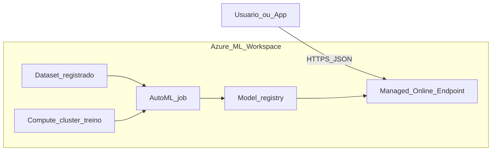

# Arquitetura — Azure ML (AutoML + Online Endpoint)

Visão de alto nível do fluxo implementado neste lab. Ao documentar o seu workspace, atualize os nomes dos recursos conforme o ambiente real.

## Componentes

| Componente | Função |
|------------|--------|
| Workspace | Ponto central para dados, experimentos, modelos e endpoints. |
| Dataset | Dados tabulares versionados usados pelo AutoML. |
| Compute cluster | Infraestrutura elástica para treinar múltiplos trials do AutoML. |
| AutoML job | Orquestra busca de algoritmos e hiperparâmetros. |
| Model registry | Armazena o artefato do melhor run com versionamento. |
| Online endpoint | Hospeda o modelo para inferência síncrona via REST. |

Para detalhes de design e decisões do seu run, consulte o [SDD do lab](../labs/azure-ml-automl-endpoint/SDD.md). Lista de recursos no **resource group** (captura de tela): seção **Recursos Azure no resource group** no [README do lab](../labs/azure-ml-automl-endpoint/README.md).
