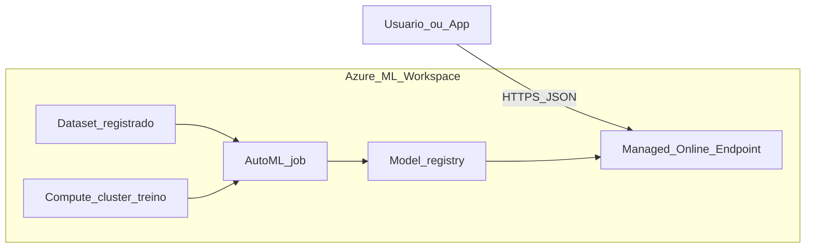
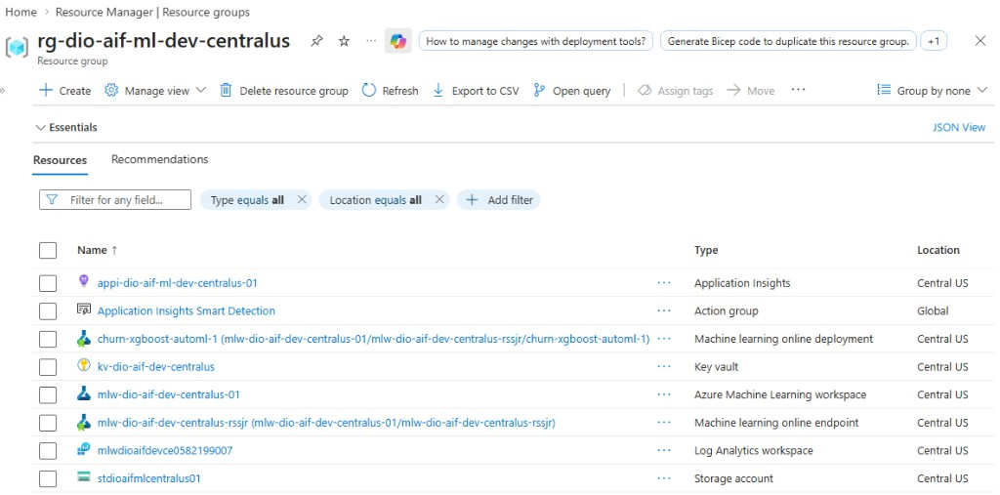
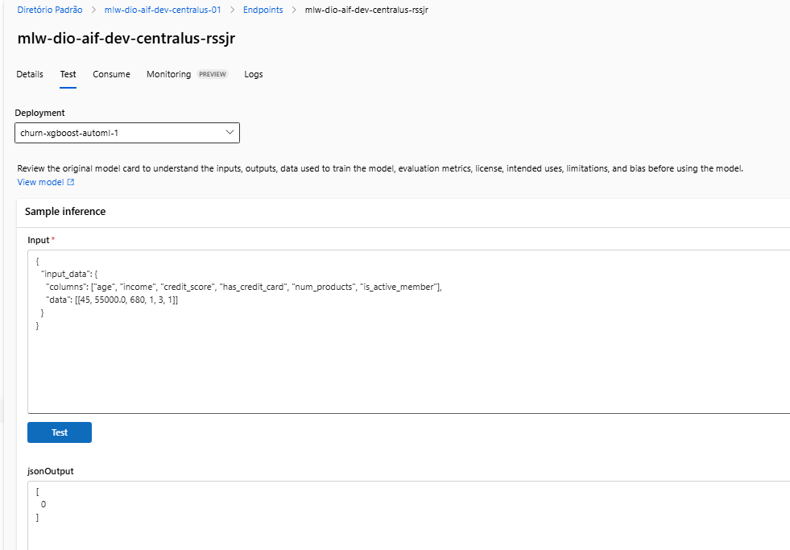

# Lab: Automated ML + Online Endpoint (Azure Machine Learning)

**Projeto 1/5** da trilha [Microsoft — Fundamentos de IA (DIO)](https://web.dio.me/track/microsoft-fundamentos-de-ia). Repositório raiz: [README da trilha](../../README.md).

## Objetivo

Treinar um modelo com **Automated ML** no Azure Machine Learning, registar o melhor run, publicá-lo num **Managed Online Endpoint** e validar inferência em tempo real via HTTP (JSON), com documentação para portfólio e entrega DIO.

- Documento de design: [SDD.md](./SDD.md)
- Passo a passo detalhado e recursos usados: [HOWTO.md](./HOWTO.md)

## Arquitetura do fluxo

Descrição textual e tabela de componentes: **[docs/architecture.md](../../docs/architecture.md)**.

Diagrama lógico (o GitHub renderiza Mermaid no preview do `README`):



## Recursos Azure no resource group

No **Portal Azure**, a vista **Resource group** **`rg-dio-aif-ml-dev-centralus`** agrega os recursos relacionados com o workspace, dados, monitorização e o **online endpoint** / **deployment** do modelo. É uma boa evidência de portfólio (mapa de infraestrutura **sem** expor chaves).



## Checklist de progresso (lab concluído)

| Fase | Descrição | Estado |
|------|-----------|--------|
| 0 | Pré-requisitos Azure (assinatura, RG, região) | Concluída |
| 1 | Workspace no Portal e acesso ao **Azure ML Studio** | Concluída |
| 2 | Dataset tabular no Studio (`ds-automl-classification-v2`) + CSV no blob | Concluída |
| 3 | Compute cluster de treino (`cpu-automl-cluster`) | Concluída |
| 4 | Job Automated ML, child run vencedor, **registo do modelo** | Concluída |
| 5 | **Managed Online Endpoint**, deployment, **Test** com JSON | Concluída |
| 6 | Limpeza de custos (compute ocioso / endpoint quando não precisar) | Opcional / contínuo |

## O que foi entregue (resumo técnico)

| Artefato | Detalhe |
|---------|---------|
| **Workspace** | `mlw-dio-aif-dev-centralus-01` (Central US) |
| **Dataset (treino AutoML)** | `ds-automl-classification-v2:1` (tabular / MLTable derivado do CSV) |
| **Dados locais** | [`data/customer_churn.csv`](data/customer_churn.csv) (sintético, alvo `churn`) |
| **Job AutoML** | `automl-churn-dio-lab-001` · experiência `automl-churn-dio-lab` |
| **Melhor modelo (registado)** | `churn-xgboost-automl:1` — **MaxAbsScaler + XGBoostClassifier**, run `willing_oxygen_r5dwc5jm` |
| **Métrica principal** | **AUC weighted** ≈ **0,99714** (validação; dados sintéticos — ver SDD) |
| **Endpoint** | `mlw-dio-aif-dev-centralus-rssjr` (managed, auth **Key**) |
| **Deployment** | `churn-xgboost-automl-1` · SKU inferência **Standard_D2a_v4** · 1 instância |
| **Ponto de extremidade (JSON)** | [`endpoint.json`](endpoint.json) — **sem chaves** |
| **Payload de teste** | [`sample-request.json`](sample-request.json) |

## Entrega DIO

Instruções típicas do curso: **repositório GitHub** com **README** (passo a passo) + **JSON do endpoint**. Este lab cumpre com:

- Este `README.md`
- [`endpoint.json`](endpoint.json) (URI e nomes públicos)
- Opcional na entrega: link do repositório raiz que contém `labs/azure-ml-automl-endpoint/`
- Evidências em `assets/screenshots/` (incluindo **resource group** em `portal/`).

**Não incluir:** chaves primárias/secundárias do endpoint em arquivos versionados.

## Dataset

1. Fonte no repo: [`data/customer_churn.csv`](data/customer_churn.csv) — classificação binária, colunas preditoras + **`churn`**.
2. No Azure ML foi criado **`ds-automl-classification-v2`** (tabular, schema com colunas inferidas) para o AutoML aceitar **Target column** `churn`. O asset inicial `ds-automl-classification-v1` (File) serviu de aprendizado; o fluxo final usa **v2**.
3. Evidências antigas com **v1** / Storage mantêm-se em `assets/screenshots/` como histórico do processo.

## Treinamento

1. **Compute:** `cpu-automl-cluster` — **Standard_E4ds_v4**, min 0 / max 1 nó, idle 120 s.
2. **Automated ML:** classificação, dataset **`ds-automl-classification-v2`**, alvo **`churn`**, **primary metric AUC weighted**, deep learning desligado, **Explain best model** ligado; **Limits:** max trials **3**, max concurrent **1**, max nodes **1**, experiment timeout **45** min, iteration timeout **15** min.
3. **Melhor child run:** **MaxAbsScaler + XGBoostClassifier** (empate de AUC com VotingEnsemble; escolhido XGBoost por simplicidade). **Registo:** `churn-xgboost-automl` versão **1**.

## Métricas

| Métrica | Valor | Observação |
|---------|------|------------|
| **Primary metric (AutoML)** | **AUC weighted** | Configurada no job. |
| **Melhor modelo (validação)** | **0,99714** | Ver limitações em [SDD.md](./SDD.md) (dados sintéticos). |

## Deploy

1. A partir do child run ou do modelo registado: **Real-time endpoint** (managed).
2. **Endpoint:** `mlw-dio-aif-dev-centralus-rssjr` · **REST:** ver [endpoint.json](./endpoint.json) (`scoring_uri`).
3. **Autenticação:** chave (`Authorization: Bearer <chave>`). Chave só em variável de ambiente ou `.env` local.
4. Header opcional recomendado: `azureml-model-deployment: churn-xgboost-automl-1` (o script `invoke_endpoint.ps1` envia se `deployment_name` estiver no JSON).

## Teste

1. Corpo alinhado a [`sample-request.json`](sample-request.json): `input_data.columns` **sem** `churn` e `data` com **pelo menos uma linha**.
2. **Test** no Studio — exemplo válido: resposta **`[0]`** (classe predita sem churn) para a linha de exemplo documentada.
3. Local (PowerShell), após `AZURE_ML_API_KEY`:

```powershell
cd labs\azure-ml-automl-endpoint\scripts
.\invoke_endpoint.ps1
```



## Evidências em `assets/screenshots/`

| Arquivo | Conteúdo |
|----------|----------|
| `01-workspace-overview.png` | Portal — workspace |
| `studio/01-home-dashboard.png` | Studio — home |
| `02-dataset-registered.png` | Data asset (fluxo inicial) |
| `storage/01-customer-churn-blobstore.png` | Blob CSV |
| `03-compute-treino.png` | Create compute cluster |
| `10-teste-inferencia.png` | Tab **Test** com sucesso |
| `portal/01-resource-group-all-resources.png` | Portal — todos os recursos do RG do lab |

Subpastas `workspace/`, `compute/`: capturas extras. Você pode adicionar `04`–`09` (AutoML, modelo, endpoint) ao organizar o portfólio.

### Organização das pastas de imagens

| Pasta | Uso |
|-------|-----|
| `assets/screenshots/` | sequência principal e `10-teste-inferencia.png` |
| `assets/screenshots/workspace/` | Portal — criação workspace |
| `assets/screenshots/studio/` | Studio — home |
| `assets/screenshots/storage/` | Storage browser |
| `assets/screenshots/compute/` | Assistente VM do cluster |
| `assets/screenshots/portal/` | Portal — resource group / lista de recursos |

## Como reproduzir (alto nível)

1. Criar **Azure ML workspace** e abrir [ml.azure.com](https://ml.azure.com).
2. Registar dataset **tabular** a partir de `customer_churn.csv` (delimitado, vírgula, UTF-8).
3. Criar **compute cluster** (CPU, min nodes 0).
4. **New Automated ML job:** classificação, alvo `churn`, limites e métrica definidos; compute acima.
5. Registar melhor modelo → **Deploy** → **Real-time endpoint**; VM inferência dentro da quota (ex. 1× Standard_D2a_v4).
6. **Test** no Studio; preencher `endpoint.json` e `sample-request.json`; **não** versionar chaves.

## Aprendizados

- **AutoML** orquestra pré-processamento e vários algoritmos; **Limits** e quota moldam custo vs. exploração.
- Dataset só como **File (uri_file)** pode impedir **Target column**; solução: asset **tabular** com schema inferido (**v2**).
- **Managed Online Endpoint**: separar **nome do endpoint**, **deployment**, **URI** e **chaves** (chaves fora do Git).
- **Test** falha com `data: []` — o corpo precisa de linhas reais em `input_data.data`.
- Boas práticas DIO/portfólio: README com racional, `endpoint.json` público, evidências em imagens sem expor credenciais.

## Publicar no GitHub e entregar na DIO (passo a passo manual)

Execute na pasta raiz do repositório (`microsoft-ai-fundamentals`), no **PowerShell** ou **Git Bash**, substituindo `SEU_USUARIO` e `SEU_REPOSITORIO` pelos valores reais.

1. **Criar o repositório no GitHub** (site [github.com/new](https://github.com/new)): nome de sua escolha; **público** recomendado para portfólio; **não** marques “Add a README” se já tem arquivos locais (evita conflito no primeiro push).

2. **Verificar que não há segredos** (revisão rápida):

   ```powershell
   cd "c:\Users\josem\Documents\Dio-Lab\microsoft-ai-fundamentals"
   Get-ChildItem -Recurse -Include *.md,*.json,*.ps1,*.env -File | Select-String -Pattern "api[_-]?key|secret|password|Bearer sk-|BEGIN PRIVATE" -SimpleMatch -ErrorAction SilentlyContinue
   ```

   Confira manualmente que `endpoint.json` **não** contém chaves (só URI e nomes).

3. **Inicializar Git e primeiro commit** (se ainda não existir `.git`):

   ```powershell
   cd "c:\Users\josem\Documents\Dio-Lab\microsoft-ai-fundamentals"
   git init
   git add .
   git commit -m "docs: Lab 1 DIO — Azure ML AutoML + Managed Online Endpoint"
   git branch -M main
   ```

4. **Ligar ao GitHub e enviar**:

   ```powershell
   git remote add origin https://github.com/SEU_USUARIO/SEU_REPOSITORIO.git
   git push -u origin main
   ```

   Se o remoto `origin` já existir por erro: `git remote remove origin` e repete o `remote add`.

5. **Abrir o repositório no browser** e confirmar: [README](../../README.md) na raiz, pasta `labs/azure-ml-automl-endpoint/`, `endpoint.json` e `sample-request.json` visíveis.

6. **Entrega na DIO**: na página do projeto **“Trabalhando com Machine Learning na Prática no Azure ML”**, usa **Entregar projeto** e cola o URL do repositório, por exemplo:

   `https://github.com/SEU_USUARIO/SEU_REPOSITORIO`

   Opcional: na descrição, indique que o lab está em `labs/azure-ml-automl-endpoint/` e que o JSON do endpoint é `labs/azure-ml-automl-endpoint/endpoint.json`.
